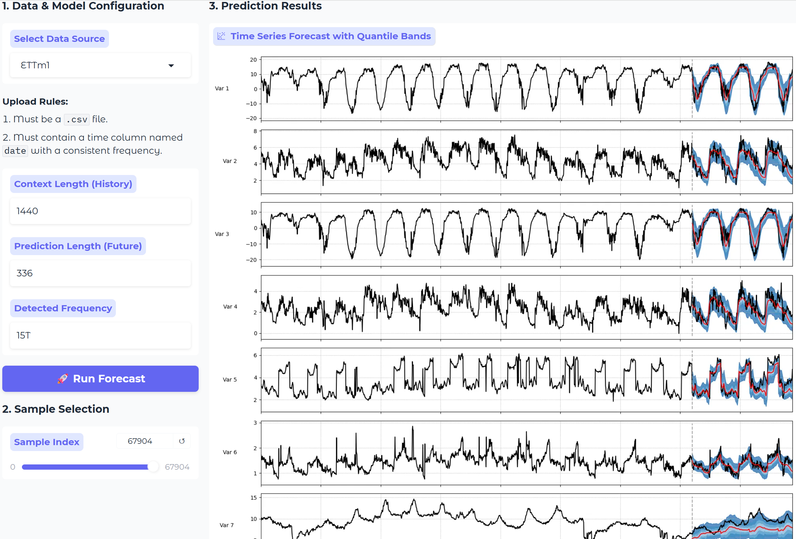

# VisionTS++

<div align="center">
 

**VisionTS++: Cross-Modal Time Series Foundation Model with Continual Pre-trained Visual Backbones**

[](https://arxiv.org/abs/2508.04379)
[](https://arxiv.org/abs/2408.17253)
[](#-quick-start)
[](https://huggingface.co/Lefei/VisionTSpp)

</div>

<details>
<summary><strong>Table of Contents</strong></summary>

- [VisionTS++](#visionts)
  - [🎉 What's New](#-whats-new)
  - [🤗 Try Huggingface Space!](#-try-huggingface-space)
  - [🔍 About](#-about)
  - [🚀 Quick Start \& Inference](#-quick-start--inference)
  - [⚙️ Installation](#️-installation)
  - [💻 Continual Pre-training](#-continual-pre-training)
  - [🔗 Citing VisionTS++](#-citing-visionts)
  - [❤️ Acknowledgement](#️-acknowledgement)

</details>


## 🎉 What's New

* 🚩 **News** (Sep 2025): We release the Hugging Face Space [[VisionTSpp on Huggingface Space]](https://huggingface.co/spaces/Lefei/VisionTSpp) ! You can now quickly experience the forecasting capability of VisionTS++ directly in your browser! You can also upload your own custom time series CSV file for zero-shot forecasting!
* 🚩 **News** (Aug 2025): The inference code is now released! Please try [[demo.ipynb]](https://github.com/HALF111/VisionTSpp/blob/main/demo.ipynb) to run VisionTS++ on multivariate and probablistic time series forecasting.
* 🚩 **News** (Aug 2025): VisionTS++ (also called VisionTSpp) preprint has been made available on [[arXiv]](https://arxiv.org/abs/2508.04379), as well as the training code and pre-trained models. Specifically, we provide the VisionTSpp-1.0-base model on [[Huggingface]](https://huggingface.co/Lefei/VisionTSpp), which we perform continual pre-traininig on [Large-scale Open Time Series Archive (LOTSA data)](https://huggingface.co/datasets/Salesforce/lotsa_data/) based on [Masked AutoEncoder (MAE)](https://github.com/facebookresearch/mae) visual backbone.

## 🤗 Try Huggingface Space!

🎉 **We’re excited to release the Huggingface Space for VisionTS++!**  
👉 [Try it now: VisionTSpp on Huggingface Space](https://huggingface.co/spaces/Lefei/VisionTSpp)

Experience the powerful forecasting capabilities of **VisionTS++** instantly — no setup or environment configuration required. Simply open the Space in your browser and start exploring!

Want to test it on your own data? Just upload a custom time series CSV file, and VisionTS++ will perform **zero-shot forecasting** out of the box.

<div align="center">

</div>

## 🔍 About

+ In this work, we propose a new time series foundation model, VisionTS++, a SOTA time series foundation model by continual pre-training visual MAE on large-scale time series data, supporting multi-variate forecasting and probablistic forecasting!

<div align="center">

</div>


+ Compared to [VisionTS](https://github.com/Keytoyze/VisionTS), VisionTS++ is equipped with three key innovations, including a `vision-model-based
filtering` mechanism that identifies high-quality time series data for pre-training, a `colorized multivariate conversion` method that transform multivariate time series into multi-subfigure RGB images, and a `multi-quantile forecasting` approach using parallel reconstruction heads to generate forecasts of different quantile levels.
+ Therefore, VisionTS++ **more effectively supports multivariate and probablistic time series forecasting**.

<div align="center">

</div>

## 🚀 Quick Start & Inference

The VisionTS++ model is also uploaded to our package in PyPI. Please run the following command for installing **VisionTS++ and VisionTS**:

```shell
pip install visionts
```

If you want to develop the inference code, you can also build from source.

```shell
git clone https://github.com/Keytoyze/VisionTS.git
cd VisionTS
pip install -e .
```

Then, you can refer to [[demo.ipynb]](https://github.com/HALF111/VisionTSpp/blob/main/demo.ipynb) on forecasting time series using **VisionTS++**, with clear visualizations of image reconstruction. 

In this demo, we show VisionTS++'s capability of effectively handling multivariate and probabilistic time series forecasting.


## ⚙️ Installation

1. Clone repository:

```shell
git clone https://github.com/HALF111/VisionTSpp.git
cd VisionTSpp
```

2. Create virtual environment:

```shell
virtualenv venv --python=python3.10
. venv/bin/activate
```

3. Build from source:

```shell
pip install -e '.[notebook]'
```

4. Create a `.env` file:

```shell
touch .env
```

## 💻 Continual Pre-training

We also provide scripts for continual pre-training on Large-scale Open Time Series Archive (LOTSA data) based on Masked AutoEncoder base (MAE-base) visual backbone. If you want to perform continual pre-training yourself, please run the following instructions.

1. You should start with preparing the data for pre-training first, by downloading the [Large-scale Open Time Series Archive (LOTSA data)](https://huggingface.co/datasets/Salesforce/lotsa_data/).
   Assuming you've already created a `.env` file, run the following commands.

```shell
huggingface-cli download Salesforce/lotsa_data --repo-type=dataset --local-dir PATH_TO_SAVE
echo "LOTSA_V1_PATH=PATH_TO_SAVE" >> .env
```

2. Afterwards, you should download MAE-base model from following links: [MAE-base](https://dl.fbaipublicfiles.com/mae/visualize/mae_visualize_vit_base.pth). You can choose to download [MAE-large](https://dl.fbaipublicfiles.com/mae/visualize/mae_visualize_vit_large.pth) or [MAE-huge](https://dl.fbaipublicfiles.com/mae/visualize/mae_visualize_vit_huge.pth) as well. 

You should also write the path where you save the MAE models in the `.env` file, for example:

```shell
echo "VISIONTS_CHECKPOINT_PATH=./project/benchmarks/ckpt" >> .env
```

3. Finally, you can simply run the following script to start the continual pre-training (the same as in [run.sh](https://github.com/HALF111/VisionTSpp/blob/main/run.sh)). 

```shell
# base model
python -m cli.train -cp conf/pretrain run_name=VisionTSpp_base  model=visionts data=lotsa_v1_weighted
```

You can also try continual pre-training on MAE-large or MAE-huge:

```shell
# large model:
python -m cli.train -cp conf/pretrain run_name=VisionTSpp_large  model=visionts_large data=lotsa_v1_weighted

# huge model:
python -m cli.train -cp conf/pretrain run_name=VisionTSpp_huge  model=visionts_huge data=lotsa_v1_weighted
```

Additionally, if you want to modify some configurations during training, you can refer to the settings in [default.yaml](https://github.com/HALF111/VisionTSpp/blob/main/cli/conf/pretrain/default.yaml), [model/visionts.yaml](https://github.com/HALF111/VisionTSpp/blob/main/cli/conf/pretrain/model/visionts.yaml) and [data/lotsa_v1_weighted_image.yaml](https://github.com/HALF111/VisionTSpp/blob/main/cli/conf/pretrain/data/lotsa_v1_weighted_image.yaml).

## 🔗 Citing VisionTS++

If you're using VisionTS++ or VisionTS in your research or applications, please cite them using this BibTeX:

```bibtex
@misc{chen2024visionts,
      title={VisionTS: Visual Masked Autoencoders Are Free-Lunch Zero-Shot Time Series Forecasters}, 
      author={Mouxiang Chen and Lefei Shen and Zhuo Li and Xiaoyun Joy Wang and Jianling Sun and Chenghao Liu},
      year={2024},
      eprint={2408.17253},
      archivePrefix={arXiv},
      url={https://arxiv.org/abs/2408.17253}, 
}

@misc{shen2025visiontspp,
      title={VisionTS++: Cross-Modal Time Series Foundation Model with Continual Pre-trained Visual Backbones}, 
      author={Lefei Shen and Mouxiang Chen and Xu Liu and Han Fu and Xiaoxue Ren and Jianling Sun and Zhuo Li and Chenghao Liu},
      year={2025},
      eprint={2508.04379},
      archivePrefix={arXiv},
      primaryClass={cs.CV},
      url={https://arxiv.org/abs/2508.04379}, 
}
```

## ❤️ Acknowledgement

We deeply appreciate the following github repos for their valuable code base or datasets:

+ VisionTS [[repo]](https://github.com/Keytoyze/VisionTS)
+ Moirai [[repo]](https://github.com/SalesforceAIResearch/uni2ts)
+ Time-Series-Library [[repo]](https://github.com/thuml/Time-Series-Library)
+ GluonTS [[repo]](https://github.com/awslabs/gluonts)
