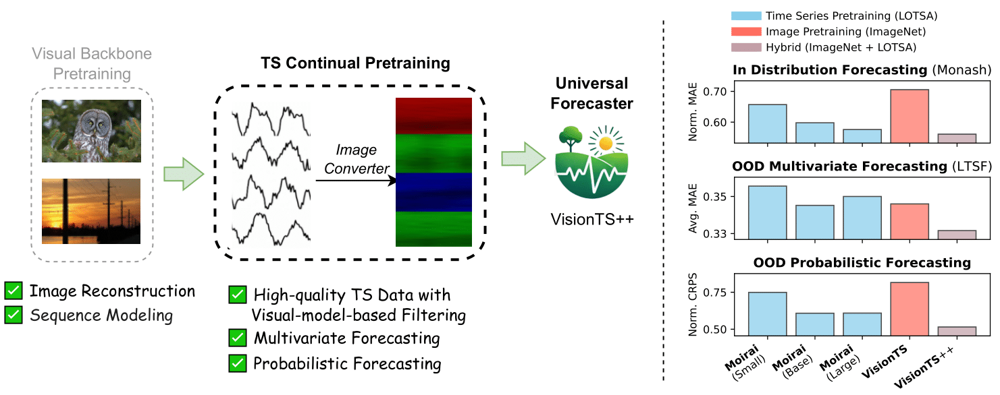

# VisionTS++

**VisionTS++: Cross-Modal Time Series Foundation Model with Continual Pre-trained Visual Backbones**

[Paper Link](https://arxiv.org/abs/2508.04379) | [Huggingface_model](https://huggingface.co/Lefei/VisionTSpp)


## 🎉 What's New

* 🚩 **News** (Aug 2025): VisionTSpp preprint has been made available on [arXiv](https://arxiv.org/abs/2508.04379). And VisionTSpp-1.0-base model is available in [Huggingface](https://huggingface.co/Lefei/VisionTSpp), which is continually pre-trained on [Large-scale Open Time Series Archive (LOTSA data)](https://huggingface.co/datasets/Salesforce/lotsa_data/) based on Masked AutoEncoder base (MAE-base) visual backbone.

## 🔍 About

+ In this paper, we propose a new time series foundation model, which performs continual pre-training on the visual backbones. 

<div align="center">

</div>

+ Compared to [VisionTS](https://github.com/Keytoyze/VisionTS), VisionTS++ is equipped with three key innovations, therefore more effectively supports multivariate and probablistic time series forecasting.

<div align="center">

</div>

## ⚙️ Installation

1. Clone repository:

```shell
git clone https://github.com/HALF111/VisionTSpp.git
cd VisionTSpp
```

2) Create virtual environment:

```shell
virtualenv venv
. venv/bin/activate
```

3) Build from source:

```shell
pip install -e '.[notebook]'
```

4) Create a `.env` file:

```shell
touch .env
```

## 💻 Continual Pre-training

We provide the scripts for starting the continual pre-training process on Large-scale Open Time Series Archive (LOTSA data) based on Masked AutoEncoder base (MAE-base) visual backbone.

You should start with preparing the data for pre-training first, by downloading the [Large-scale Open Time Series Archive (LOTSA data)](https://huggingface.co/datasets/Salesforce/lotsa_data/).
Assuming you've already createed a `.env` file, run the following commands.

```shell
huggingface-cli download Salesforce/lotsa_data --repo-type=dataset --local-dir PATH_TO_SAVE
echo "LOTSA_V1_PATH=PATH_TO_SAVE" >> .env
```

Then, you can simply run the following script to start the continual pre-training (the same as in [run.sh](https://github.com/HALF111/VisionTSpp/blob/main/run.sh)). 

```shell
# base model
python -m cli.train -cp conf/pretrain run_name=VisionTSpp_base  model=visionts data=lotsa_v1_weighted
```

You can also try continual pre-training on MAE-large or MAE-huge:

```shell
# large model:
python -m cli.train -cp conf/pretrain run_name=VisionTSpp_large  model=visionts_large data=lotsa_v1_weighted

# huge model:
python -m cli.train -cp conf/pretrain run_name=VisionTSpp_huge  model=visionts_huge data=lotsa_v1_weighted
```

## 🔗 Citing VisionTS++

If you're using VisionTSpp in your research or applications, please cite it using this BibTeX:

```markdown
@misc{shen2025visiontscrossmodaltimeseries,
      title={VisionTS++: Cross-Modal Time Series Foundation Model with Continual Pre-trained Visual Backbones}, 
      author={Lefei Shen and Mouxiang Chen and Xu Liu and Han Fu and Xiaoxue Ren and Jianling Sun and Zhuo Li and Chenghao Liu},
      year={2025},
      eprint={2508.04379},
      archivePrefix={arXiv},
      primaryClass={cs.CV},
      url={https://arxiv.org/abs/2508.04379}, 
}
```

## Acknowledgement

We deeply appreciate the following github repos for their valuable code base or datasets:

+ VisionTS [[repo]](https://github.com/Keytoyze/VisionTS)
+ Moirai [[repo]](https://github.com/SalesforceAIResearch/uni2ts)

